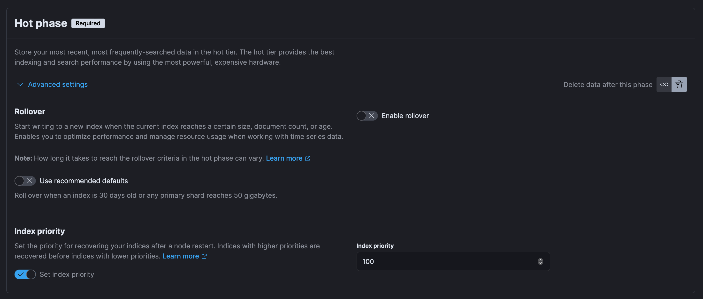

= Project setup

This file contains documentation which applies to all projects.
Project-specific setup guides can be found in the
`development/project-setup.adoc` files in other projects. All required
software components and their configurations can be found in the
`development` directory (in the `common` project and in other projects
where it exists).

== Https/TLS
To run applications with `TLS` you need a keystore. The certificate in the
keystore can be either self-signed or provided by a CA. You can use `openssl`
and java's `keytool` utility for working with keystore. To create all the
necessary files, follow these steps:

* Create a `~/universe-simulator` directory.

* In the `~/universe-simulator` directory create a keystore file with a
self-signed certificate and private key: `keytool -genkeypair -v
-alias universe-simulator -keystore universe-simulator.p12 -keyalg RSA
-validity 365 -ext SAN=dns:localhost,ip:127.0.0.1`

* Extract the certificate from the keystore with:
`openssl pkcs12 -in universe-simulator.p12 -out universe-simulator-cert.pem
-nokeys`

== Consul
* Run `docker-compose -p universe-simulator up -d consul`

* Create a `config` folder in Consul's `Key/Value`.

* Inside the `config` folder create a `application` folder. Properties
in this folder will be available to all services for all profiles. Add
the following properties with `data` as key:

[source, json]
----
{
  "spring.cloud.consul.discovery.scheme": "https",
  "spring.cloud.consul.discovery.health-check-tls-skip-verify": true,
  "server.ssl.key-store": "${HOME}/universe-simulator/universe-simulator.p12",
  "server.ssl.key-store-password": "{your-key-store-password}",
  "server.http2.enabled": true,
  "server.shutdown": "graceful",
  "spring.sleuth.sampler.probability": 1.0,
  "spring.zipkin.sender.type": "rabbit",
  "spring.rabbitmq.template.exchange": "universe-simulator",
  "management.endpoints.web.exposure.include": "*",
  "management.endpoint.health.show-details": "always",
  "management.info.java.enabled": true,
  "app.rabbitmq.event-queue": "event"
}
----
#Replace the `{your-key-store-password}` placeholder with your actual
keystore password.#

* Inside the `application` folder create a `local` folder. Properties
in this folder will be available to all services for `local` profile
only. Add the following properties with `data` as key:

[source, json]
----
{
  "spring.rabbitmq.username": "user",
  "spring.rabbitmq.password": "password",
  "app.logstash-url": "localhost:4560"
}
----

* You can add additional configuration in the `config` folder using the
`{application-name}/{profile}` pattern, where `application-name` maps
to the `spring.application.name` property in `application.properties`
and `profile` maps to your active spring boot profile.

== RabbitMQ
Run `docker-compose -p universe-simulator up -d rabbitmq`

== Elasticsearch

Run `docker-compose -p universe-simulator up -d elasticsearch`

You can find mode information in the official
https://www.elastic.co/guide/en/elasticsearch/reference/current/docker.html[
setup guide].

== Kibana

Run `docker-compose -p universe-simulator up -d kibana`

You can find mode information in the official
https://www.elastic.co/guide/en/kibana/current/docker.html[
setup guide].

=== Templates
Go to `Stack Management > Index Management > Index Templates` in
`Kibana` and create the following index template:

* Name: `logstash`
* Index patterns: `logstash-*`
* Index settings:

[source, json]
----
{
  "index": {
    "number_of_shards": "1",
    "number_of_replicas": "0"
  }
}
----

=== Lifecycle policies
Go to `Stack Management > Index Lifecycle Policies` and add a policy for
the `logstash` index template:

* Policy name: `logstash`
* Hot phase: Delete data after this phase
* Hot phase > Rollover: disable `Use recommended defaults`
* Hot phase > Rollover: disable `Enable rollover`

* Add `logstash` policy to the `logstash` index template.

=== Data views
After starting applications, go to `Stack Management > Data Views`
and add the following data view:

* Name: `logstash-*`
* Timestamp field: `@timestamp`

You can add microservice-specific data views using the following
syntax: `logstash-{service}-*` where `service` maps to the
`spring.application.name` property in `application.properties`.

== Logstash
Run `docker-compose -p universe-simulator up -d logstash`

== Configuration

=== Properties
Create a `application-local.properties` file next to
`application.properties` in all projects except `common` and add the
following properties:

----
spring.config.import=consul:
server.port={port-of-your-choice}
----

=== Environment variables
Add the following OS environment variables:

* `US_GITHUB_PACKAGES_USER`
* `US_GITHUB_PACKAGES_TOKEN`
* `US_CONSUL_HOST`
* `US_CONSUL_PORT`

== Running an application
You can run an application with the `local` profile from your IDE or
with the following command: `./gradlew bootRun
--args='--spring.profiles.active=local'`.
